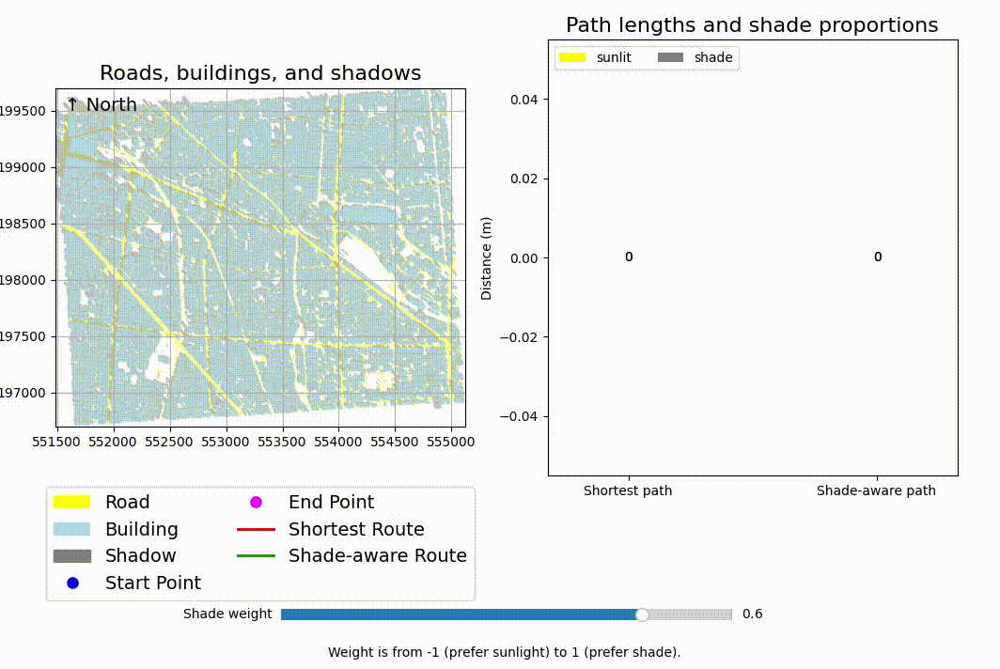

# Shade-aware Route Planning

This program computes the shortest path between two points while taking into account the shade created by surrounding buildings. A parameter makes it possible to adjust the tradeoff between the total length of the route and the proportion of the route covered in shade.

## Dependencies

Our project runs on Python 3.11.11. Please refer to [requirements.txt](requirements.txt) for the dependencies.

## Running the program

Our default scenario is set in a part of Abeno Ward, Osaka.
The time interval is from 9:00 to 10:00 AM on December 5, 2024.
You can run `main.py` directly and adjust the shadow weight to control your preference for sunlight or shade.

If you wish to simulate other locations or time periods (within Osaka City), please load the corresponding data from the tran and bldg folders.

For areas outside Osaka, refer to the PLATEAU dataset.
Then run `precompute_shadow_ratios_offline.py` and `precompute_shadows_offline.py` to generate the corresponding offline shadow data, and proceed with `main.py`.

## Contributors

This program was created by Liuyi Yang, Takuto Miyata, and Shota Kuroki under the supervision of [Patrick Finnerty](https://patfin.github.io/) and [Takateru Urakubo](https://www.lab.kobe-u.ac.jp/csi-uav/urakubo/index.html) as part of a _Co-Creation and Collaboration ($C^3$)_ project in the [Kobe University Graduate School of System Informatics](https://www.csi.kobe-u.ac.jp/).

## License

This program is provided under the [MIT License](License.txt). 
